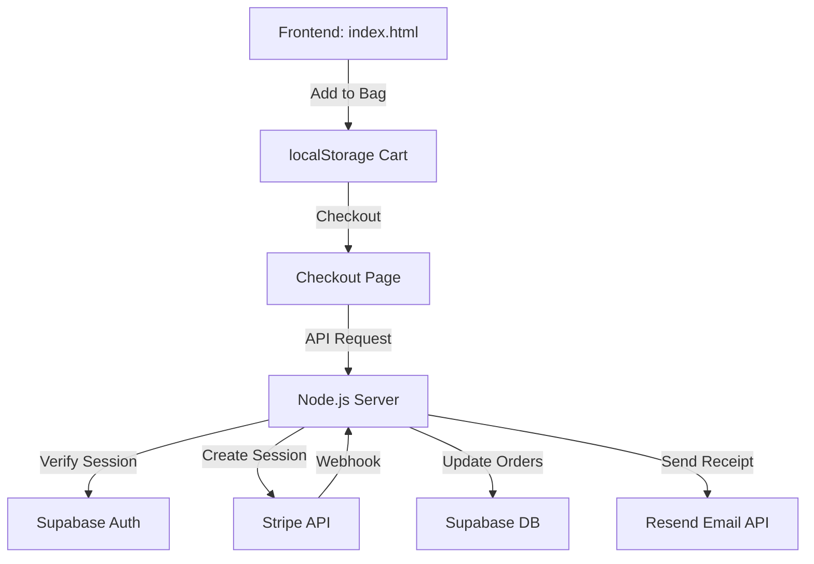

# ♛ The Princess Network

**The Princess Network** is a premium, high-end e-commerce experience dedicated to crowns, tiaras, and all things royal. Designed with a focus on luxury aesthetics and seamless user interactions, this platform offers a curated collection for every modern princess.

---

## Features

### Premium Storefront
- **Immersive Hero Experience**: Dynamic split-screen auto-moving banners with cinematic Ken Burns effects.
- **Responsive Product Grid**: Optimized 2-column layout for mobile with "always-on" Add to Bag functionality.
- **Glassmorphic Design**: Modern, sophisticated UI using translucent cards and elegant typography (Cinzel & Jost).

### Dynamic Shopping Flow
- **Functional Royal Cart**: Real-time state management using `localStorage` for item persistence.
- **Smart Progress Tracking**: Dynamic shipping threshold indicator ($75 free shipping target).
- **Seamless Checkout**: A dedicated, multi-column checkout interface with automatic subtotal and shipping calculations.

### Robust Backend Foundation
- **Node.js/Express API**: A scalable server architecture prepared for secure transaction handling.
- **Supabase Integration**: Centralized database and authentication management.
- **Stripe Payments**: Integrated secure payment processing via Stripe Checkout.
- **Transactional Emails**: Automated order confirmations powered by the Resend API.

---

## Technology Stack

| Layer | Technologies |
| :--- | :--- |
| **Frontend** | HTML5, Vanilla CSS3, JavaScript (ES6+) |
| **Backend** | Node.js, Express.js |
| **Database/Auth** | Supabase (PostgreSQL) |
| **Payments** | Stripe API |
| **Email** | Resend API |
| **Styling** | Custom Design System (Golden/Royal Accents) |

---

## Getting Started

### Prerequisites
- [Node.js](https://nodejs.org/) (v16+)
- A [Supabase](https://supabase.com/) account
- A [Stripe](https://stripe.com/) account
- A [Resend](https://resend.com/) API key

## Architecture

---

## License

Distributed under the MIT License. See `LICENSE` for more information.

---

  <i>Developed with elegance for The Princess Network</i> 

